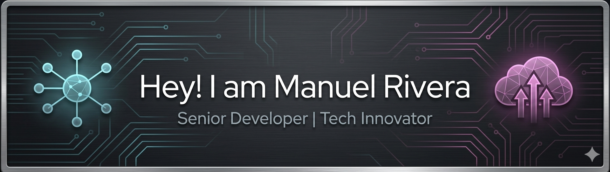

# Bienvenido a mi  GITHUB  👋

<!-- Banner Personalizado -->

<!-- Efecto de Escritura Dinámico -->

<!-- Redes Sociales-->

  
  
  
  
  

 <!-- gifphy-->
 

  

    

---

## 🚀 Perfil Profesional

Soy un desarrollador enfocado en crear soluciones móviles de alto rendimiento y arquitecturas web escalables. Me apasiona la integración entre el hardware y el software para resolver problemas cotidianos.

*   **Mobile**: Especialista en el ecosistema de **Dart** y **Flutter**.
*   **Backend**: Experiencia sólida desarrollando con **PHP (Laravel)** y **C#**.
*   **Hardware**: Diseño y programación de prototipos utilizando **Arduino** y diversos sensores.

---

## 🛠️ Lenguajes de programación

<table align="center">
  <tr>
    <td align="center" width="200"><strong>Mobile</strong></td>
    <td align="center" width="200"><strong>Backend</strong></td>
    <td align="center" width="200"><strong>Database / Cloud</strong></td>
  </tr>
  <tr>
    <td align="center">
      
    </td>
    <td align="center">
      
    </td>
    <td align="center">
      
    </td>
  </tr>
  <tr>
    <td align="center"><strong>IoT / Herramientas</strong></td>
    <td align="center" colspan="2"><strong>Productivity</strong></td>
  </tr>
  <tr>
    <td align="center">
      
    </td>
    <td align="center" colspan="2">
      
    </td>
  </tr>
</table>

---

## 📊 Estadísticas de GitHub

<!-- REEMPLAZA 'TU_USUARIO' CON TU NOMBRE REAL DE GITHUB ABAJO -->

---

*"Construyendo el futuro, una línea de código a la vez."*

